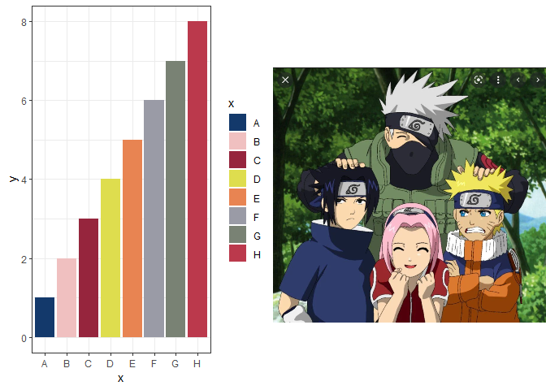

<!-- README.md is generated from README.Rmd. Please edit that file -->

# ggNaruto

<!-- badges: start -->
<!-- badges: end -->

The goal of ggNaruto is to provide Colour palettes inspired by Naruto.

## Installation

You can install the released version of ggNaruto from
[github](https://github.com/NotebookOFXiaoMing/ggNaruto) with:

``` r
devtools::install_github("NotebookOFXiaoMing/ggNaruto")
```

## Example

This is a basic example which shows you how to solve a common problem:

``` r
library(ggplot2)
#> Warning: package 'ggplot2' was built under R version 4.0.5
library(ggNaruto)
library(cowplot)
help(package="ggNaruto")
naruto_palette("Jiraiya")
#> [1] "#f6f6f4" "#0d0d0d" "#c0c1ba" "#ddcb82" "#a34635" "#999a7a" "#565b3e"
#> [8] "#7e5a4b" "#898989"
#> attr(,"class")
#> [1] "palette"
#> attr(,"name")
#> [1] "Jiraiya"
naruto_palettes
#> $Jiraiya
#> [1] "#f6f6f4" "#0d0d0d" "#c0c1ba" "#ddcb82" "#a34635" "#999a7a" "#565b3e"
#> [8] "#7e5a4b" "#898989"
#> 
#> $Team7
#> [1] "#13396b" "#f0c0c0" "#96253d" "#dedd4e" "#e88452" "#9a9ba6" "#798274"
#> [8] "#bb394c"

dat01<-data.frame(x=LETTERS[1:8],y=1:8)
ggplot(data=dat01,aes(x=x,y=y))+
  geom_col(aes(fill=x))+
  scale_fill_naruto_d(name = "Team7")+
  theme_bw() -> my_plot

team7<-system.file("extdata",'team7.png',package = "ggNaruto")
team7
#> [1] "D:/Biotools/R/R-4.0.3/library/ggNaruto/extdata/team7.png"
ggdraw() +
  draw_image(team7) -> p2

plot_grid(my_plot,p2)
```


